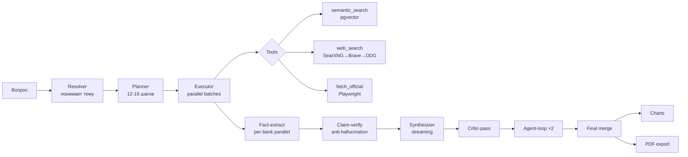

<div align="center">

# 🔍 AuditLens

**Deep-Research платформа для внутреннего аудита банковских продуктов**

LLM-агент + RAG + structured БД. Задаёшь вопрос на русском — получаешь аналитический отчёт со ссылками на первоисточники, графиками и PDF-экспортом за 1-3 минуты.

[](LICENSE)
[](https://www.python.org/downloads/)
[](https://github.com/pgvector/pgvector)

[Быстрый старт](#-быстрый-старт-5-минут) · [Онбординг разработчика](docs/ONBOARDING.md) · [Документация](docs/) · [Архитектура](docs/ARCHITECTURE.md) · [Troubleshooting](docs/TROUBLESHOOTING.md)


</div>

---

## 🎯 Для кого

**Аналитики и аудиторы банковского сектора**, которым нужно регулярно сравнивать продукты разных банков, искать данные по ставкам/тарифам/жалобам клиентов, и готовить отчёты для руководства. AuditLens заменяет ручной обзвон 5-10 сайтов банков, копирование цифр в Excel и склеивание в Word — на один запрос на русском языке.

---

## ⚡ Что умеет

<table>
<tr>
<td width="50%" valign="top">

### 🔬 Deep Research
Многоступенчатый pipeline: planner → executor → fact-extract → claim-verify → synth → critic → agent-loop → merge.

12-16 параллельных шагов сбора, 9 LLM-проходов, типичное время **1-3 мин** на отчёт.

</td>
<td width="50%" valign="top">

### 📚 Цитаты и trust scoring
Каждое утверждение в отчёте имеет ссылку `[N]` на источник.

Trust-классы: 🟢 регуляторы (cbr.ru, pravo.gov.ru — 0.98), 🟡 банки (0.95), 🟠 агрегаторы (0.65), 🔴 блоги (исключаются).

</td>
</tr>
<tr>
<td width="50%" valign="top">

### 🛡 Anti-hallucination
3 уровня защиты:
- topical filter (off-topic документы исключаются)
- **claim-verify** — regex проверяет что каждое число РЕАЛЬНО есть в источнике
- citation-filter (удаление невалидных `[N]`)

</td>
<td width="50%" valign="top">

### 📊 Графики и PDF
Автоматическая визуализация числовых сравнений через Chart.js (sequential editorial-palette).

PDF-экспорт через Playwright Chromium — A4, embedded шрифты, графики, источники.

</td>
</tr>
<tr>
<td width="50%" valign="top">

### 🌐 Универсальный поиск
4 backend'а с автоматическим fallback:
**SearXNG** (7 движков, безлимит) → **Brave** API → **DDG** → **Yandex**.

Поддержка Russian Trusted Root CA для Сбера / ЦБ / госсайтов.

</td>
<td width="50%" valign="top">

### 🧠 Universal product support
Работает с **любым** банковским продуктом без хардкода. Resolver-LLM сам определяет:
- тему / синонимы / морф-формы
- URL-paths для landing-страниц
- нужны ли govt-источники (НПА, ЦБ)

</td>
</tr>
</table>

---

## 🚀 Быстрый старт (5 минут)

### Что нужно

| | Где взять |
|---|---|
| **Python 3.11+** | `brew install python@3.12` (mac) · `sudo apt install python3.12` (Linux/WSL) |
| **Docker Desktop** | [Mac (Apple Silicon)](https://desktop.docker.com/mac/main/arm64/Docker.dmg) · [Mac (Intel)](https://desktop.docker.com/mac/main/amd64/Docker.dmg) · [Windows](https://desktop.docker.com/win/main/amd64/Docker%20Desktop%20Installer.exe) · [Linux](https://docs.docker.com/engine/install/) |
| **Git** | `brew install git` (mac) · `sudo apt install git` (Linux/WSL) |
| **Fireworks AI ключ** | [fireworks.ai](https://fireworks.ai/) → Sign Up (бесплатные $15) |

### Шаги (TL;DR)

```bash
# 1. Скачать
git clone https://github.com/SashaEee/auditLens.git
cd auditLens

# 2. Один скрипт = всё установлено (Docker, БД, Python deps, миграции)
bash scripts/setup.sh

# 3. Впиши Fireworks-ключ в .env
open -e .env       # mac (откроет TextEdit)
# или: nano .env   # любая ОС (Ctrl+X для выхода)
# Замени fw_REPLACE_WITH_YOUR_KEY на свой ключ

# 4. Запусти сервер
source .venv/bin/activate
uvicorn bank_audit.web.app:app --host 127.0.0.1 --port 8000
```

Открой [http://127.0.0.1:8000](http://127.0.0.1:8000) → введи вопрос → готово.

> 📖 **Не уверен в командах?** → [docs/SETUP.md](docs/SETUP.md) — пошаговый гайд для новичков с разделением по mac/Windows/Linux и чек-листом
> 🔑 **Где взять API-ключ Fireworks?** → [docs/API_KEYS.md](docs/API_KEYS.md)

---

## 💬 Примеры вопросов

> Полный гайд с десятками примеров → [docs/USAGE.md](docs/USAGE.md)

**Сравнительные исследования (включи 🔬 Deep Research):**

```
Семейная ипотека: ставки, первый взнос, требования к доходу
в Сбер, ВТБ, Альфа-банк, ДомРФ
```

```
Сравни премиальные дебетовые карты Сбер Прайм, Тинькофф Premium,
Альфа Wealth по комиссиям, кешбэку, привилегиям
```

```
РКО для ИП с оборотом до 10 млн/год: тарифы, эквайринг, бесплатные
операции — Сбер, Тинькофф, Точка, Модульбанк
```

```
Карта ветерана СВО: условия, привилегии, льготы в банках-участниках
проекта (Сбер, ВТБ, ПСБ, Газпромбанк)
```

**Быстрые запросы (без Deep Research):**

```
Топ-10 жалоб клиентов Тинькофф за последний месяц
```

```
Покажи актуальные ставки по вкладам от 1 млн руб на 12 мес
```

---

## 🖼 Скриншоты

### Аналитический dashboard


*Главный экран — еженедельная сводка по позиции банка в рынке: где сильнее/слабее, динамика, изменения условий, флаги качества.*

### ИИ-аналитик (чат)


*Чат-интерфейс с быстрыми запросами справа и подсказками по подключённым источникам.*


*Длинный вопрос введён, режим Deep Research включён (кнопка слева от поля ввода).*

### Deep Research в работе


*Стадия Discovery: planner раскладывает вопрос на шаги, сбор источников через semantic_search + fetch_official.*


*15/15 шагов выполнено, 27 источников (24 high-trust, 3 mid). План отчёта (4 раздела) сгенерирован outline-planner'ом. 56 фактов прошли claim-verify, 4 отфильтровано (защита от галлюцинаций).*

### Боковые секции

<table>
<tr>
<td width="50%">


*Источники: карточки документов с trust-индикаторами и фильтрами.*

</td>
<td width="50%">


*База знаний — семантический поиск по проиндексированным документам.*

</td>
</tr>
<tr>
<td width="50%">


*Отзывы клиентов с группировкой по темам и тональности.*

</td>
<td width="50%">


*Рынок: маркет-офферы из v_offer_current с фильтрами по банку/категории.*

</td>
</tr>
</table>

---

## 🏗 Архитектура



> Полное описание pipeline'а → [docs/ARCHITECTURE.md](docs/ARCHITECTURE.md)

**Стек:**
- **Python 3.11+**, FastAPI, SQLAlchemy 2, asyncio
- **PostgreSQL 16 + pgvector** для семантического поиска (1024d embeddings, BGE-M3)
- **React** (через Babel-standalone, без bundler'а — простое развёртывание)
- **Playwright Chromium** для real-time fetch и PDF-экспорта
- **LLM** — Fireworks AI (OpenAI-compatible), поддержка Claude/локальных vLLM
- **Web search** — SearXNG / Brave / DuckDuckGo / Yandex с automatic fallback

---

## 📦 Структура репозитория

```
auditlens/
├── README.md                        ← ты здесь
├── LICENSE                          ← MIT
├── pyproject.toml                   ← зависимости
├── .env.example                     ← шаблон конфига
├── docker-compose.yml               ← Postgres + SearXNG
├── docs/
│   ├── SETUP.md                     ← детальная установка
│   ├── API_KEYS.md                  ← где брать ключи (Fireworks $15)
│   ├── USAGE.md                     ← примеры вопросов
│   ├── ARCHITECTURE.md              ← как устроен pipeline
│   ├── TROUBLESHOOTING.md           ← типовые проблемы
│   └── img/                         ← скриншоты для README
├── docker/
│   ├── postgres/init/               ← init pgvector
│   └── searxng/                     ← конфиг SearXNG
├── migrations/                      ← SQL миграции (001-009)
├── scripts/
│   ├── setup.sh                     ← автоустановщик
│   └── demo_seed.py                 ← демо-данные
├── config/
│   ├── ca_bundle_combined.pem       ← certifi + Russian Trusted Root
│   └── russian_trusted_root.pem     ← сертификат Минцифры
└── src/bank_audit/
    ├── ai/                          ← LLM-логика (resolver, planner, deep_research)
    ├── rag/                         ← embedder, retriever, fetcher, web_search, trust
    ├── collectors/                  ← Playwright browser collectors
    ├── normalizer/                  ← rule-based классификация отзывов
    └── web/                         ← FastAPI + React UI + PDF export
```

---

## 🛣 Roadmap

- [x] Deep Research pipeline с agent-loop
- [x] Claim-level verification (anti-hallucination)
- [x] Universal product support (любой банковский продукт без хардкода)
- [x] Govt trust whitelist (cbr.ru / pravo.gov.ru / mil.ru / gosuslugi)
- [x] PDF export с графиками
- [ ] Авторизация (single-user → multi-user)
- [ ] Загрузка собственных PDF из UI
- [ ] Excel-экспорт сравнительных таблиц
- [ ] Snapshot-based diff («что изменилось в условиях по вкладам за месяц»)
- [ ] Telegram/Slack бот-интерфейс
- [ ] Поддержка локальных LLM (vLLM/Ollama) из коробки

---

## 🤝 Контрибьюции

PR'ы welcome. Перед отправкой:
1. `pip install -e ".[dev]"` — поставит pytest + ruff
2. `ruff check src/` — линтер
3. `pytest tests/` — тесты (если есть для твоей области)
4. Опиши **зачем** изменение, не только **что** сделано

---

## 📜 Лицензия

[MIT](LICENSE) — свободное использование с указанием авторства.

## 🙏 Acknowledgments

- [pgvector](https://github.com/pgvector/pgvector) — векторный поиск в Postgres
- [SearXNG](https://github.com/searxng/searxng) — open-source мета-поисковик
- [BGE-M3](https://huggingface.co/BAAI/bge-m3) — multilingual embeddings
- [Fireworks AI](https://fireworks.ai/) — fast inference для open-weights моделей
- [Chart.js](https://www.chartjs.org/) — графики в UI и PDF

---

<div align="center">
Сделано для аудиторов, которые хотят тратить время на анализ, а не на сбор данных.
</div>
