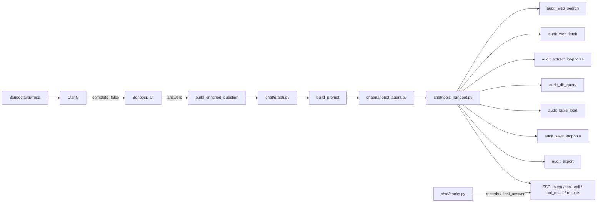
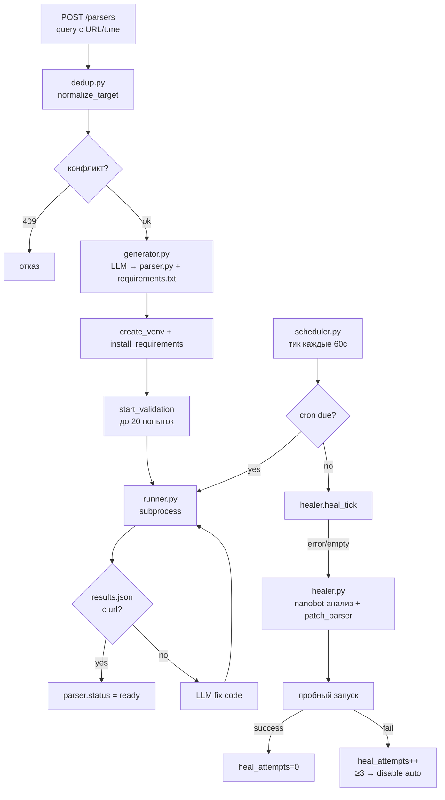
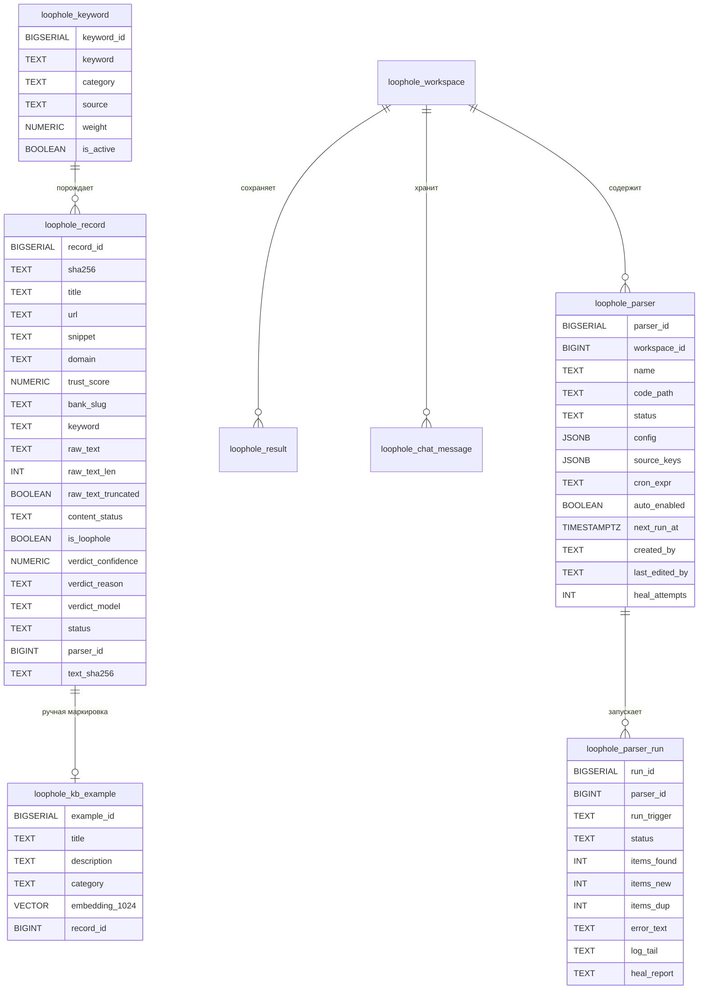

# Архитектура модуля `bank_audit.loophole`

Модуль ищет **лазейки** — слабые места в продуктах и тарифах банков, которые клиенты эксплуатируют для ухода от комиссий, обхода лимитов или продления грейса. Это не хищение, а использование несовершенства условий, несущее банку потери.

## 1. Общая схема

```mermaid
flowchart TB
    subgraph UI["Фронт (React / iframe /api/loophole)"]
        Chat["Чат-агент"]
        Table["Таблица records"]
        ParsersCatalog["Каталог парсеров"]
    end

    subgraph API["FastAPI: src/bank_audit/loophole/web.py"]
        EP_Search[/search]
        EP_Records[/records]
        EP_Verdict[/records/verdict]
        EP_Chat[/chat SSE]
        EP_Clarify[/clarify]
        EP_Parsers[/parsers]
        EP_Run[/parsers/{id}/run]
        EP_Heal[/parsers/{id}/heal]
    end

    subgraph Core["Ядро модуля"]
        Collector["collector.py\nавто-сбор keywords"]
        Classifier["classify.py\nвердикт лазейка/не лазейка"]
        Refine["refine.py\nLLM-уточнение keywords"]
        Repository["repository.py\nCRUD к БД"]
        Workspace["workspace.py\nper-user workspace"]
    end

    subgraph ChatAgent["Чат-агент (nanobot)"]
        Graph["chat/graph.py"]
        Clarify["chat/clarify.py"]
        Nanobot["chat/nanobot_agent.py"]
        Tools["chat/tools_nanobot.py"]
        Hooks["chat/hooks.py"]
    end

    subgraph KB["База знаний"]
        KBRepo["kb/repository.py"]
        KBSeed["kb/seed.py"]
    end

    subgraph Parsers["Генерируемые парсеры"]
        Generator["parsers/generator.py\nLLM → Scrapy-паук"]
        Runner["parsers/runner.py\nsubprocess + log-bus"]
        Scheduler["parsers/scheduler.py\ncron-тикер"]
        Healer["parsers/healer.py\nnanobot-исправление"]
        Registry["parsers/registry.py\nCRUD каталога"]
        Dedup["parsers/dedup.py\nключи источников/текста"]
    end

    subgraph Adapters["Адаптеры сети"]
        SearchDec["adapters/search_decorator.py"]
        FetchDec["adapters/fetch_decorator.py"]
        ContentFetch["content_fetch.py"]
    end

    subgraph RagLayer["Общий слой RAG"]
        WebSearch["rag/web_search"]
        Fetcher["rag/fetcher"]
        Embedder["rag/embedder"]
    end

    Chat --> EP_Chat --> Graph --> Nanobot --> Tools
    Tools --> SearchDec --> WebSearch
    Tools --> FetchDec --> Fetcher
    Tools --> Repository
    EP_Clarify --> Clarify --> Graph

    Collector --> SearchDec
    Collector --> FetchDec
    Collector --> Classifier --> Repository
    Refine --> Repository

    EP_Parsers --> Generator --> Runner --> Repository
    EP_Run --> Runner
    EP_Heal --> Healer --> Generator --> Runner
    Scheduler --> Runner --> Healer
    Registry --> Repository
    Dedup --> Generator & Runner

    KBRepo --> Repository & Embedder
    KBSeed --> KBRepo
    Workspace --> Repository

    ParsersCatalog --> EP_Parsers
    Table --> EP_Records & EP_Verdict
```

## 2. Слои и компоненты

### 2.1 API-слой (`web.py`)

`APIRouter` с префиксом `/api/loophole`. Авторизация внешняя — `user_id` из заголовка `X-User-Id`.

Ключевые эндпоинты:

| Эндпоинт | Назначение |
|---|---|
| `POST /search` | Полнотекстовый поиск по `loophole_record` |
| `GET /records` | Список записей с фильтрами (банк, дата, статус, вердикт) |
| `POST /records/verdict` | Ручная маркировка «лазейка/обычный запрос» + обновление KB |
| `POST /records/backfill-content` | Догрузка полного контента для legacy/fetch_failed записей |
| `POST /chat` | SSE-чат с nanobot-агентом |
| `POST /clarify` + `/clarify/answer` | Воронка уточняющих вопросов |
| `POST /parsers` | Создание Scrapy-парсера через LLM |
| `PATCH /parsers/{id}` | Редактирование cron/имени/автозапуска |
| `POST /parsers/{id}/run` | Ручной запуск парсера |
| `POST /parsers/{id}/heal` | Запуск nanobot-исправления сбойного парсера |
| `GET /parsers/{id}/log/stream` | SSE-стрим лога запуска |
| `POST /export` / `/export/csv` | Выгрузка записей JSON/CSV |

### 2.2 Хранение (`repository.py`, `db_schema.py`)

Все SQL-запросы через `sqlalchemy.text()`. Без ORM. Диалект Greenplum 6 — без `PRIMARY KEY` и `UNIQUE`. Дедупликация на уровне приложения по `sha256`.

Таблицы:

| Таблица | Назначение |
|---|---|
| `loophole_keyword` | Ключевые слова авто-сбора (seed/refined/manual) |
| `loophole_record` | Найденные записи: title, url, snippet, raw_text, verdict |
| `loophole_workspace` | Per-user workspace |
| `loophole_result` | Сохранённые результаты поиска по workspace |
| `loophole_chat_message` | История сообщений чата |
| `loophole_action_log` | Аудит-лог действий пользователя |
| `loophole_agent_task` | Агентные задачи (ReAct-фазы, legacy-поля) |
| `loophole_kb_example` | Few-shot примеры лазеек + pgvector embedding |
| `loophole_kb_doc` | RAG-документы/чанки |
| `loophole_parser` | Каталог генерируемых парсеров + cron/автозапуск |
| `loophole_parser_run` | История запусков парсеров + логи |

### 2.3 Авто-сбор (`collector.py`, `keywords.py`, `classify.py`, `refine.py`)

Поток:

```mermaid
flowchart LR
    K[keywords.py\nactive_keywords] --> C[collector.py]
    C --> S[search_decorator]
    S --> F[fetch_decorator]
    F --> R[repository.insert_record]
    R --> CL[classify.py\nclassify_record]
    CL --> U[repository.update_verdict]
    R --> Ref[refine.py\n(периодически)]
    Ref --> K
```

- `collector.collect_once`: для каждого активного keyword → web_search → fetch → insert → classify.
- Дедуп по `sha256 = sha256(url + "|" + snippet)`.
- Фильтр по `trust_score < LOOPHOLE_TRUST_MIN` и домену.
- `classify_record`: LLM-вердикт `is_loophole` / `confidence` / `reason`.
- `refine_keywords`: анализирует найденные лазейки и генерирует новые keywords через LLM.

### 2.4 Чат-агент на nanobot (`chat/`)



Особенности:

- **Встроенные инструменты nanobot отключены** (`web`, `exec`, `file`, `cliApps`, `my`, `imageGeneration`) — LLM не может выполнять код или писать файлы.
- **Clarify-воронка**: `generate_clarifications` → вопросы → `build_enriched_question`. `skip_clarify` предотвращает зацикливание.
- **Маскировка ПДн**: `pii_mask.py` заменяет телефоны, карты, ИНН, СНИЛС, паспорт, email, ФИО, адреса на плейсхолдеры `[TYPE_N]`.
- **Кастомные tools**: `audit_web_search`, `audit_web_fetch`, `audit_extract_loopholes`, `audit_db_query`, `audit_table_load`, `audit_save_loophole`, `audit_export`.
- **Gemini-совместимость**: `_collapse_type_arrays` схлопывает `"type": ["string", "null"]` в `"type": "string"` для function_declarations.

### 2.5 База знаний (`kb/`)

- `kb/seed.py`: идемпотентная загрузка 15 примеров из `config/loophole_kb_seed.yaml` или builtin-списка.
- `kb/repository.py`: `add_example` эмбеддит description через `rag.embedder` и сохраняет в `loophole_kb_example`.
- Семантический поиск по `embedding <=> :emb::vector` (cosine distance) с graceful fallback на `[]` если pgvector недоступен.
- Ручная маркировка `/records/verdict` добавляет/удаляет пример KB, связанный с `record_id`.

### 2.6 Генерируемые парсеры (`parsers/`)



- `generator.py`: LLM-генерация Scrapy-паука по запросу пользователя. Парсер сохраняется в `parsers/catalog/parser_<id>_<name>/`.
- `runner.py`: запуск `python parser.py` в venv, stdout/stderr → SSE-лог. Результаты из `results.json` или stdout → `loophole_record` с дедупом по `sha256`, `url`, `text_sha256`.
- `scheduler.py`: asyncio-тикер каждые 60 с, запуск due парсеров, затем heal-фаза.
- `healer.py`: для сбойных/пустых auto-парсеров nanobot диагностирует источник, патчит код через `audit_patch_parser`, устанавливает зависимости, запускает пробный run. 3 неудачи → отключение auto.
- `registry.py`: CRUD каталога + runtime-статус + статистика карточек.
- `env.py`: кросс-платформенный путь к Python внутри venv (`Scripts/python.exe` на Windows, `bin/python` на Unix).

### 2.7 Адаптеры и утилиты

- `adapters/search_decorator.py`: обёртка над `rag.web_search.search` с in-memory LRU-кешем (10 мин) и нормализацией.
- `adapters/fetch_decorator.py`: обёртка над `rag.fetcher.fetch` + `parse_auto` → `FetchedPage` с `title/text/excerpt/via`.
- `content_fetch.py`: единая точка получения полного текста страницы с лимитом `LOOPHOLE_RAW_TEXT_MAX_CHARS` и статусами `full/truncated/empty/fetch_failed/legacy`.
- `pii_mask.py`: маскировка ПДн перед отправкой в LLM и логи.
- `workspace.py`: per-user директории на ФС `<LOOPHOLE_WORKSPACE_DIR>/<user_id>/<workspace_id>/`.
- `logging_audit.py`: аудит-лог действий.

## 3. Модели данных



## 4. Потоки данных (подробно)

### 4.1 Авто-сбор лазеек

1. `collector.collect_once` получает активные keywords из `keywords.py`.
2. Для каждого keyword вызывает `search_decorator.search` (max `LOOPHOLE_MAX_RESULTS_PER_KEYWORD`).
3. Результаты фильтрует по `trust_score` и известным банковским доменам.
4. Для каждого URL: `fetch_decorator.fetch_and_parse` → `content_fetch.limit_content`.
5. Считает `sha256(url + "|" + snippet)` и проверяет дедуп.
6. Вставляет `LoopholeRecord` в `repository.insert_record`.
7. Запускает `classify_record` — LLM даёт вердикт `is_loophole`.
8. Периодически `refine_keywords` анализирует найденные лазейки и добавляет новые keywords.

### 4.2 Чат-агент

1. `POST /chat` сохраняет сообщение пользователя.
2. Если `skip_clarify=False`, `clarify.generate_clarifications` решает, нужны ли уточнения.
3. Если запрос полный — `build_enriched_question` собирает итоговый NL-запрос.
4. `chat.graph.stream_chat` запускает nanobot.
5. Nanobot вызывает кастомные tools (поиск, fetch, extract, SQL, save, export).
6. `chat.hooks.AuditHook` собирает `tools_used`, `records`, `final_answer`.
7. События мапятся на SSE: `phase`, `question`, `tool_call`, `tool_result`, `token`, `records`, `answer`.
8. Ответ ассистента сохраняется в `loophole_chat_message`.

### 4.3 Ручная маркировка

1. `POST /records/verdict` с `record_ids` и `is_loophole`.
2. `repository.update_verdict` обновляет `is_loophole`, `confidence=1.0`, `reason=manual:user_id`.
3. Если `is_loophole=True` и примера ещё нет — `kb.add_example` создаёт запись в `loophole_kb_example`.
4. Если `is_loophole=False` — `repository.delete_kb_example_by_record` удаляет пример.

### 4.4 Создание и жизненный цикл парсера

1. `POST /parsers` — `generator.extract_targets` извлекает URL/t.me из запроса.
2. `registry.find_conflicts` проверяет `source_keys` на дубли — 409 при полном дубле.
3. `generator.generate_parser` вызывает LLM, создаёт директорию, venv, requirements, parser.py.
4. `start_validation` запускает до 20 итераций: run → если нет results.json с url → LLM чинит код → повтор.
5. При успехе `parser.status = ready`, иначе parser удаляется.
6. `scheduler.tick` каждые 60 с запускает due парсеры по cron.
7. После запуска `healer.heal_tick` смотрит последний run: error/empty → heal → nanobot патчит код → пробный run.
8. 3 неудачи подряд → `auto_enabled = FALSE`.

## 5. Безопасность и изоляция

- **READ-ONLY SQL**: `audit_db_query` проверяет, что запрос начинается с `SELECT`, не содержит `DROP/INSERT/UPDATE/DELETE/ALTER/CREATE/TRUNCATE/GRANT/EXEC/UNION`, `;`, `--`, `/* */`, и при необходимости добавляет `LIMIT 500`.
- **Отключены встроенные инструменты nanobot**: `web`, `exec`, `file`, `cliApps`, `my`, `imageGeneration` — агент не может писать файлы или выполнять код напрямую.
- **Маскировка ПДн**: перед LLM и в финальный ответ все чувствительные данные заменяются на плейсхолдеры.
- **Изолированные venv парсеров**: каждый парсер живёт в своём venv, код в `parsers/catalog/`, не в git.
- **Дедуп идемпотентности**: app-level sha256, без PK/UNIQUE в БД (требование Greenplum 6).

## 6. Конфигурация

Env-переменные модуля (`LOOPHOLE_*`):

| Переменная | Дефолт | Назначение |
|---|---|---|
| `LOOPHOLE_COLLECT_CRON` | `06:00` | Время ежедневного авто-сбора |
| `LOOPHOLE_MAX_RESULTS_PER_KEYWORD` | 10 | Глубина поиска на keyword |
| `LOOPHOLE_CLASSIFY_MODEL` | — | fallback на `LLM_MODEL_SMART`/`LLM_MODEL_NAME` |
| `LOOPHOLE_CHAT_MODEL` | — | fallback на `LLM_MODEL_FAST`/`LLM_MODEL_NAME` |
| `LOOPHOLE_NANOBOT_MODEL` | — | fallback на `LLM_MODEL_FAST`/`LLM_MODEL_NAME` |
| `LOOPHOLE_NANOBOT_MAX_ITERATIONS` | 20 | Максимум tool-итераций nanobot |
| `LOOPHOLE_TRUST_MIN` | 0.5 | Минимальный trust_score для источника |
| `LOOPHOLE_RAW_TEXT_MAX_CHARS` | 200000 | Лимит полного текста страницы |
| `LOOPHOLE_WORKSPACE_DIR` | `<ROOT>/workspace/loophole` | Директория workspace |
| `LOOPHOLE_ASKING_ENABLED` | 1 | Включить clarify-воронку |
| `PARSER_RUN_TIMEOUT_S` | 900 | Таймаут запуска парсера |
| `PARSER_SCHED_TICK_S` | 60 | Период тикера scheduler |
| `PARSER_MAX_HEAL_ATTEMPTS` | 3 | Лимит попыток самовосстановления |
| `PARSER_SCHEDULER_ENABLED` | 1 | Включить cron-тикер |

## 7. Интеграция с остальным проектом

- Модуль монтируется в `web/app.py` как `include_router(loophole.web.router)`.
- Использует общий `bank_audit.db` для сессий и `bank_audit.config` для `ROOT`.
- LLM-утилиты — `bank_audit.ai.llm_utils` (тиринг, `_loose_json_loads`, `_patch_client_reasoning_effort`).
- Поиск/fetch — `bank_audit.rag.web_search`, `bank_audit.rag.fetcher`, `bank_audit.rag.parsers.parse_auto`.
- Эмбеддинги — `bank_audit.rag.embedder`.
- Доверие/домены — `bank_audit.rag.trust.compute_trust`, `KNOWN_BANK_DOMAINS`.
- Банковские slug'и — `bank_audit.ai.llm_utils.detect_bank_slugs`.

## 8. Известные долги и нюансы

- `hook.records` в чате — мёртвая заглушка; таблица наполняется через `audit_save_loophole` + refresh после чата.
- Тесты `tests/loophole/*` частично имеют кросс-импорты; при добавлении новых миграций нужно обновлять `call_count` в тестах схемы.
- `migrations/016_loophole_content.sql` добавляет `content_status` и `raw_text_len`; legacy-записи получают `content_status='legacy'` и догружаются через `/records/backfill-content`.
- Миграции 012-016 применяются атомарно через `db_schema.apply_migration`.
- Название `MIGRATION_011_PATH` в `db_schema.py` исторически указывает на файл `013_loophole_agent.sql`.
