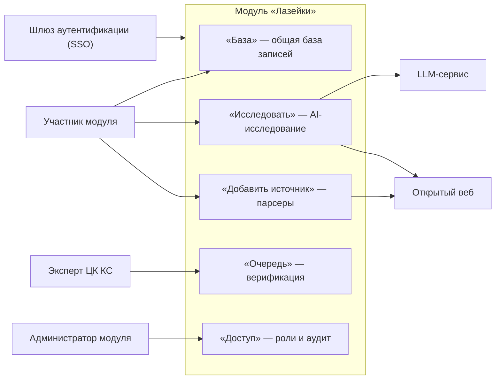
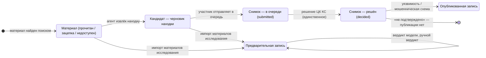
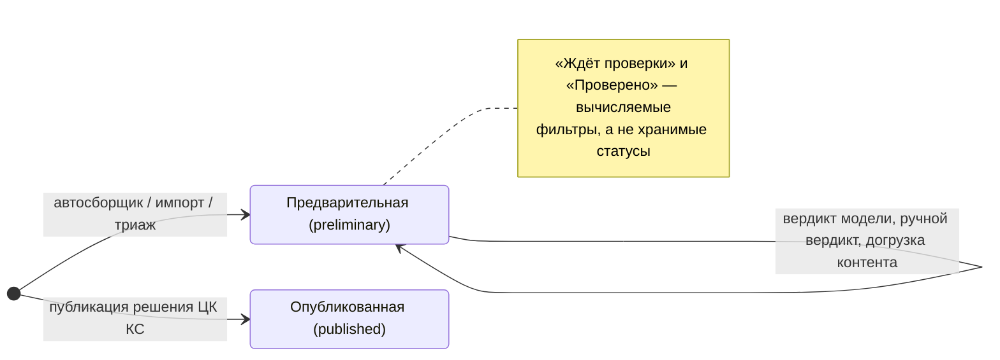
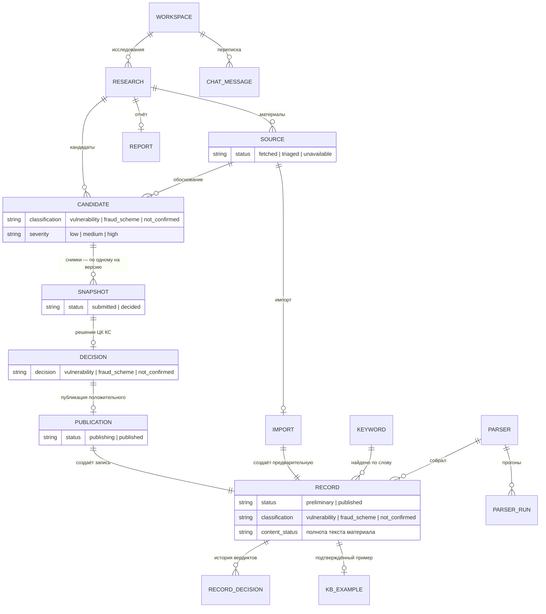
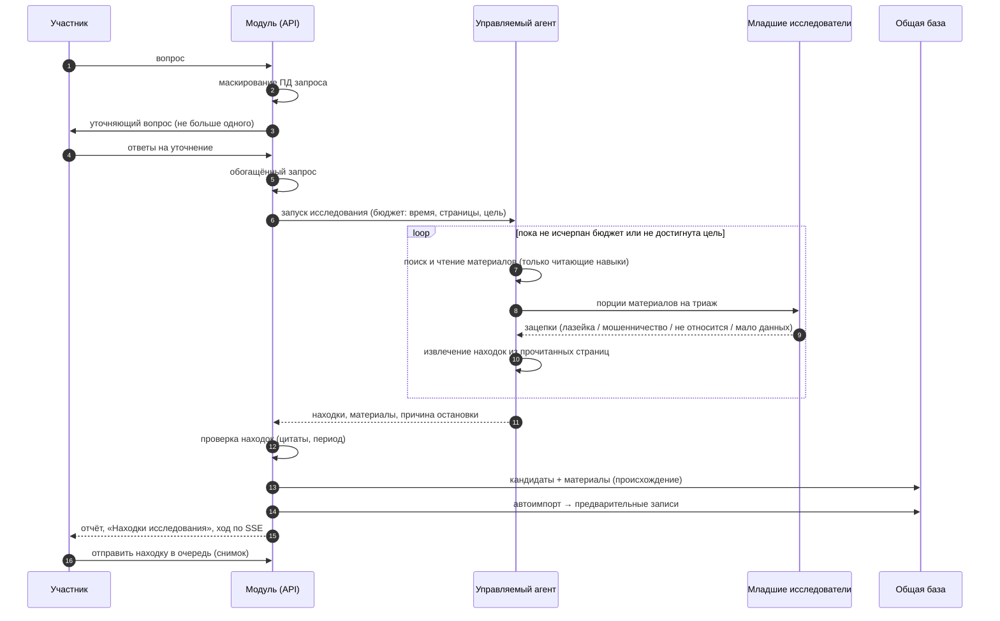
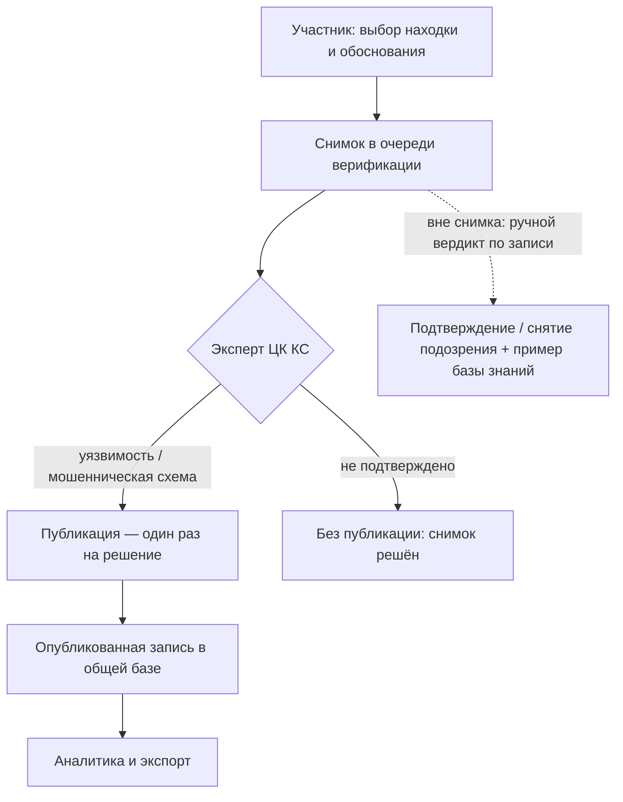
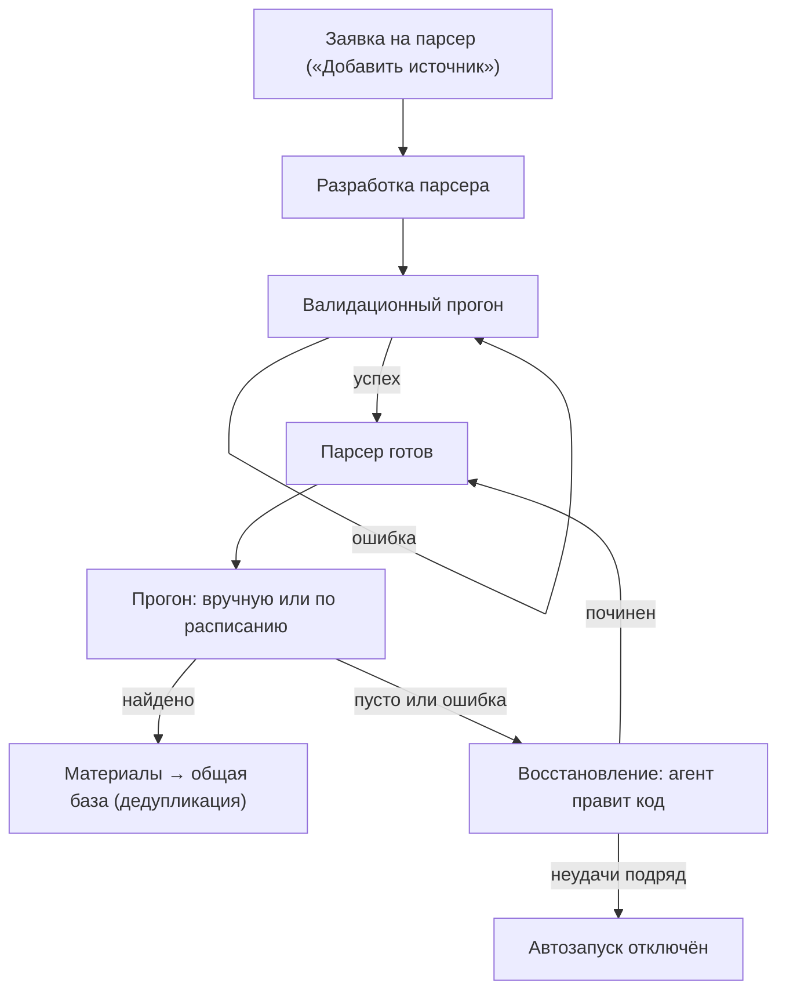
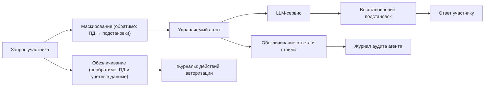
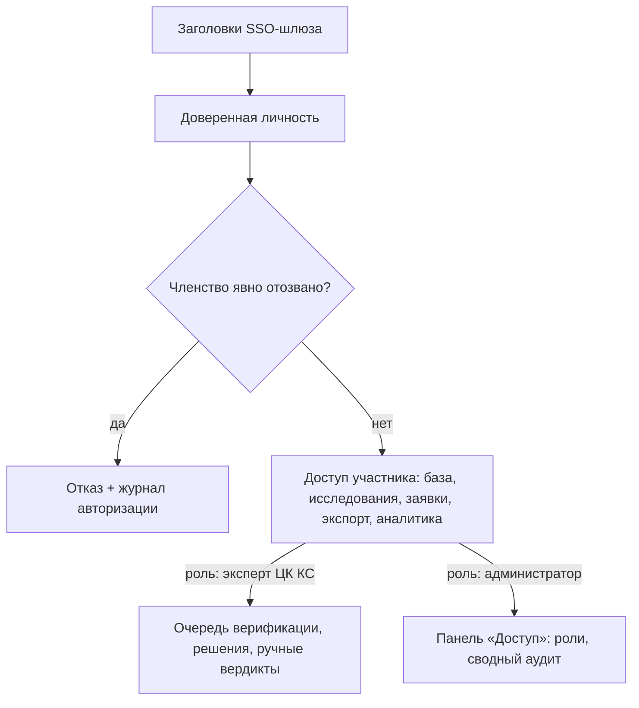

# Доменная модель модуля «Лазейки»

Концептуальная модель домена модуля «Лазейки»: контуры, сущности, жизненные циклы
и потоки данных. Канонический язык — в
[../GLOSSARY.md](../GLOSSARY.md); здесь пользуемся только им.

Модель описывает **домен**, а не реализацию: имена таблиц и файлов собраны в
приложении А.

## 1. Контекст и роли

Модуль обслуживает три роли. Базовый доступ участника — общий для всех, у кого нет
явного отзыва членства; роли эксперта и администратора назначаются поверх.

| Действие | Участник | Эксперт ЦК КС | Администратор |
|---|---|---|---|
| Общая база, поиск, экспорт, аналитика | да | да | да |
| AI-исследование: запуск, история, шэринг | да (своё) | да | да |
| Отправка находки в очередь (снимок) | да (своё) | да | да |
| Решение ЦК КС по снимку | — | да | — |
| Ручной вердикт по записи | — | да | да |
| Роли, сводный аудит доступа | — | — | да |
| Заявка на парсер, прогоны, расписания, восстановление | да | да | да |

## 2. Жизненный цикл находки

Два контура. **Верификационный** — кандидат становится снимком, эксперт ЦК КС
выносит единственное решение, положительное решение публикуется. **Предварительный**
— материалы исследования импортируются в общую базу как предварительные записи
без экспертного решения.

Инварианты контура:

- снимок неизменяем; на черновую версию кандидата — один снимок;
- решение ЦК КС — одно на снимок, не меняется и не удаляется;
- публикация — одна на решение и только для «уязвимости» и «мошеннической схемы»;
- у предварительной записи перехода «предварительная → опубликованная» нет:
  публикация создаёт отдельную запись по решению ЦК КС.

## 3. Жизненный цикл записи

Ручной вердикт ставится прямо на записи (экспертом ЦК КС или администратором):
положительный делает запись подтверждённым примером базы знаний, отрицательный
снимает с подозрения. Статус публикации он не меняет.

## 4. Сущности

Концептуальная схема. Каждой сущности отвечает словарь из глоссария; ключевые
статусы подписаны.

Пояснения:

- **Материал** хранится как происхождение прогона и не меняется задним числом;
  из него вырастают и кандидат, и предварительная запись.
- **Решение ЦК КС** и **история вердиктов** — разные сущности: первая про снимок
  кандидата, вторая про запись общей базы.
- У **вердикта** записи источник оценки различается: модель, ручной вердикт, триаж.

## 5. Поток AI-исследования

Ограждения потока: запрос маскируется перед моделью; сбой уточнения или агента —
отказ без запуска, а не «пустой успех»; каждый запуск оставляет запись в журнале
аудита агента.

## 6. Верификация и публикация

## 7. Парсеры

Создание парсера по заявке выполняется вне агента; заявка только фиксирует
потребность.

## 8. Защита данных

Два разных механизма; подменять их друг другом нельзя.

## 9. Доступ

Проверки выполняются на каждом защищённом запросе: отзыв членства действует
со следующего же запроса, без перевыпуска чего-либо.

## 10. Зафиксированные конфликты терминов

Конфликты, найденные при сверке кода, UI и спеков, с принятым каноном:

| Конфликт | Как встречается | Канон |
|---|---|---|
| Имя модуля | код и UI: «Лазейки» (раньше в UI: «Уязвимости») | модуль «Лазейки»; «Уязвимости» — устаревшее имя |
| «кейс» | запуск исследования / кандидат / запись каталога | исследование, кандидат, запись |
| «вердикт» | оценка записи vs решение эксперта | вердикт — про запись; решение ЦК КС — про снимок |
| «workspace» | контейнер чата vs «исследование» в UI | рабочее пространство = контейнер; исследование = запуск |
| «классификация» | enum находки, тема лазейки, категории ключевых слов и примеров БЗ | классификация — только enum; остальное — тема/категория |
| «верификация» vs «валидация» | очередь эксперта vs пробный прогон парсера | верификация — экспертный контур; валидация — парсеры |
| «каталог» | записи vs каталог кода парсеров | общая база; каталог парсеров (код) |
| «маскирование» vs «обезличивание» | обратимо для модели vs необратимо для журналов | два разных термина, не синонимы |
| «аудит-лог» | три разные сущности | журнал действий, журнал аудита агента, журнал авторизации |
| «находка» | агентская находка vs импортированная запись | находка → кандидат → запись |
| «предварительный» | статус записи, модельная оценка, триаж, импорт | предварительная запись; остальное — своими терминами |
| «run» | запуск агента vs прогон парсера | исследование; прогон парсера |
| даты | точная, оценочная, дата сбора | дата публикации, оценочная дата, дата сбора |

Замечания по реализации (вне глоссария, для техдолга):

- комментарии миграций парсеров расходятся с фактическими статусами в коде;
- таблицы «агентной задачи» и «сохранённого результата поиска» — легаси старой
  ReAct-архитектуры, актуальный поток — управляемый агент;
- «отзыв материала» задуман в схеме, но писателя в коде нет — машина состояний
  материала фактически однонаправленная;
- метки зацепок, классификация находки и категории базы знаний — три таксономии
  без явного отображения друг в друга.

## Приложение А. Соответствие терминов и кода

| Термин | Таблицы / код |
|---|---|
| Рабочее пространство | `loophole_workspace`, `loophole/chat/` |
| Исследование | `loophole_research`, `loophole/research_cases.py` |
| Материал | `loophole_research_source` |
| Кандидат | `loophole_research_candidate` |
| Снимок | `loophole_verification_snapshot` |
| Решение ЦК КС | `loophole_verification_decision` |
| Публикация | `loophole_publication_mapping` |
| Импорт материалов | `loophole_preliminary_import` |
| Запись | `loophole_record` |
| История вердиктов | `loophole_record_decision` |
| Отчёт | `loophole_research_report` |
| Переписка | `loophole_chat_message` |
| Ключевое слово | `loophole_keyword` |
| База знаний | `loophole_kb_example`, `loophole_kb_doc` |
| Парсер / прогон | `loophole_parser`, `loophole_parser_run`, `loophole/parsers/` |
| Заявка на парсер | `source_proposal` |
| Журналы | `loophole_action_log`, `agent_audit_log`, `loophole_auth_audit` |
| Доступ | `loophole_principal`, `loophole_workspace_membership`, `loophole_role_assignment` |
| Аналитика | `loophole_scheduled_query`, `loophole_scheduled_result` |
| Легаси | `loophole_result`, `loophole_agent_task` |

## Приложение Б. Кандидаты на ADR

Решения, которые соответствуют критериям ADR (трудно обратить, удивительно без
контекста, был реальный выбор). Пока не оформлены:

1. **Контракт жизненного цикла находки**: неизменяемый снимок + единственное
   append-only решение + идемпотентная публикация вместо прямого редактирования
   записи каталога.
2. **Разделение маскирования и обезличивания**: обратимые подстановки только для
   кругового похода к модели, необратимая очистка — для журналов, аудита и стрима.
3. **Server-side RBAC с явным отзывом**: доступ от заголовков шлюза на каждом
   запросе, без модульных сессий и токенов.
